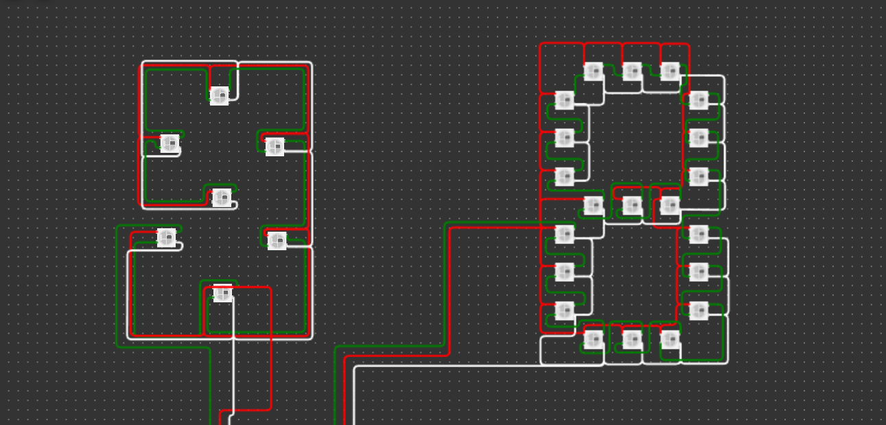

# Foobar

Hi this is my project with esp32,
this code made with platformIO envirotment 


## Application Programming Interface.
This code uses an API to control a device, please see the API. [Documentation](./src/api.md)

## Segment Schematic



## Upload a bin file

You can use the esptool.py command. Here are the steps:
- Make sure you have Python and pip installed on your Linux system.
- Open a terminal in Linux.
- Install esptool.py by running the following command:
    
    ```bash
    pip install esptool
    ```
- Connect the ESP32 to your Linux computer using a USB cable.
- Open a terminal and run the following command to check the port used by the ESP32:
    
    ```bash
    dmesg | grep ttyUSB
    ```
    Note the output of this command to determine the port being used (e.g., /dev/ttyUSB0).

- Once you know the port used by the ESP32, run the following command to erase any existing firmware on the ESP32 (optional):
    
    ```bash
    esptool.py --port /dev/ttyUSB0 erase_flash
    ```
    Make sure to replace "/dev/ttyUSB0" with the appropriate port for your device.

- After erasing the firmware (or if you don't want to erase it), run the following command to upload the bin file to the ESP32:
    
    ```bash
    esptool.py --chip esp32 --port /dev/ttyUSB0 write_flash -z 0x1000 path_to_your_bin_file.bin
    ```
    Make sure to replace "/dev/ttyUSB0" with the correct port and "path_to_your_bin_file.bin" with the full path to your bin file.

- Wait for the upload process to complete. Once finished, the ESP32 will start running the program from the newly uploaded bin file.

Those are the general steps to upload a bin file to ESP32 using Linux and esptool.py. Make sure you have the necessary drivers installed and select the correct port to connect the ESP32 to your computer.

## Clone project to your local machine

```bash
git clone https://github.com/yopaaa/digital-clock-ws1228b.git

cd digital-clock-ws1228b

code .
```

## Contributing

Pull requests are welcome. For major changes, please open an issue first
to discuss what you would like to change.

## License

[MIT]()